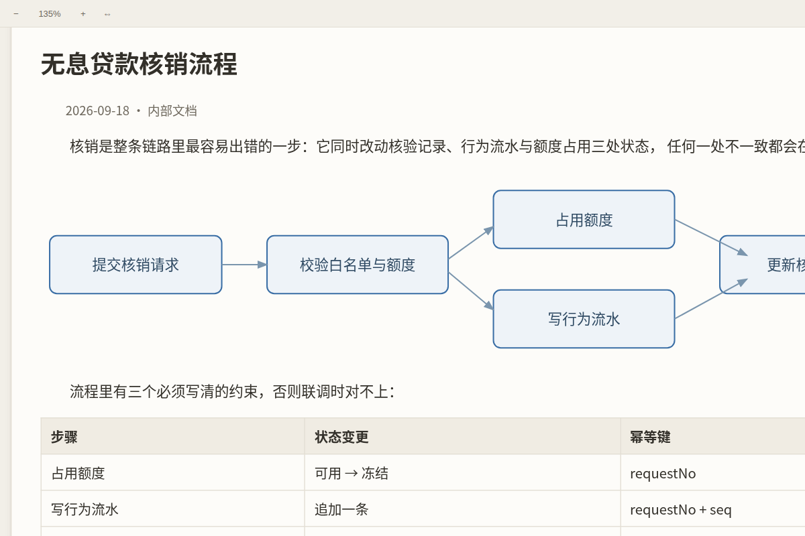
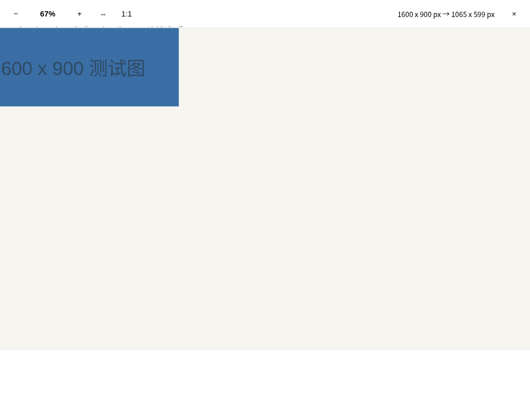
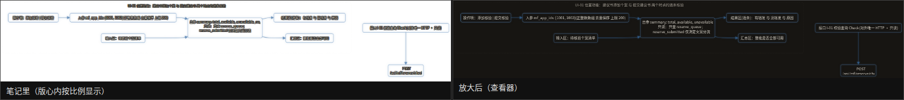
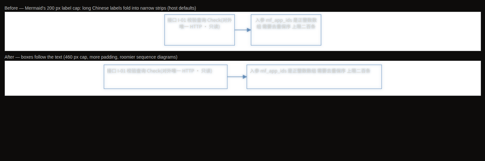

# Zoomable Reader

> 把任何一篇笔记放进一块可以平移、可以缩放的白板里读 —— 手机上双指捏合，桌面按 Ctrl 滚轮，拖动即平移。

Read any note on a pan-and-zoom board: pinch on mobile, Ctrl and wheel on desktop, drag to pan.
Handy for wide diagrams, tables and screenshots that are unreadable at 100% in the reading view.

[](LICENSE)



## Why this exists

Obsidian's reading view cannot be pinch-zoomed on mobile, and no theme can change that: the app
runs in a WebView whose zoom is a native, app-level switch (Capacitor's `zoomEnabled`, off by
default), plus a `user-scalable=no` viewport declaration. CSS cannot reach either one.

A plugin can. Zoomable Reader opens the note in its own view, renders the Markdown into a
transformable layer, and handles the gestures itself — so pinch-to-zoom finally works on a phone,
and wide diagrams or screenshots can be read by zooming in instead of squinting.

## Usage

1. Open a note, then run **Zoomable Reader: Open the active note** from the command palette, or
   click the **zoom-in icon** in the ribbon. Note: run the command name exactly as shown; the
   ribbon icon does the same thing.
2. Gestures:
   - **Mobile** — one finger drags (pan), two fingers pinch (zoom), double-tap toggles 100% / 200%.
   - **Desktop** — drag to pan, **Ctrl or Cmd and wheel** to zoom at the pointer, wheel to pan,
     double-click toggles 100% / 200%.
   - Keyboard: `+` / `-` / `0` (zoom in, zoom out, reset).
3. The toolbar has zoom out, the current zoom level (click it to reset), zoom in and fit width.

Notes:

- The note's column width follows your theme (`--file-line-width`), and on a phone it never
  exceeds the viewport — so 100% is already "one screen wide", and zooming only ever magnifies.
- Zoom and position can be remembered per note. They are stored in this plugin's own
  `data.json` inside your vault.
- The view is a board, so dragging pans instead of selecting text. Use the normal reading view
  when you need to select or edit text.

## Privacy and disclosures

- **No network access.** This plugin makes no HTTP requests and loads no remote assets.
- **No telemetry.** Nothing is collected, and nothing leaves your device.
- **No access outside your vault.** The plugin only reads notes through Obsidian's own vault API.
- The only data it writes is `data.json` in this plugin's folder (your zoom levels and positions).
- No ads, no accounts, no payment.

## Settings

| Setting | Default | What it does |
|---|---|---|
| Remember zoom and position per note | on | Restores the zoom, pan and position next time you open that note |
| Double-tap zoom | 2x | How far a double-click or double-tap zooms in |
| Maximum zoom | 8x | Upper limit for pinch and wheel zoom |
| Show toolbar | on | Zoom buttons and the zoom label |
| Page padding | 16px | Gap between the note and the edge of the view |
| Click images to open a zoomable viewer | on | The top right corner button appears on images |
| Always show the zoom button | on | Off: the button only appears on hover |
| Open the viewer by clicking images too | off | On: a click on the image also opens the viewer |
| Click diagrams to open a zoomable viewer | on | Same viewer for Mermaid diagrams |
| Fit to window when the viewer opens | on | Off: images open at 100% |
| Clear saved zoom and positions | — | Forgets every note's saved zoom |

## Image viewer

Every image and diagram carries a small button in its top right corner — click that to open it
full screen. The button is always there, so you never have to hunt for it (turn off *Always show
the zoom button* if you prefer it to appear only on hover). Clicking the image itself keeps its
usual meaning; on touch devices, where there is no hover, a tap opens the viewer.



- Zoom: mouse wheel with **Ctrl** or **Cmd**, the toolbar buttons, `+` / `-` / `0`, or a two-finger
  pinch on mobile.
- Pan: drag. Double-click (or double-tap) toggles between 100% and fit.
- Close: `Esc`, the `x` button, or a click on the empty background.
- The toolbar shows the real size and the size currently on screen, so you can tell when you are
  at 100% of a 4K screenshot.
- Nothing is decorated: images are shown as they are, and diagrams keep their transparent
  background with solid lines and text — the same look as in the note, only bigger.
- A diagram in the viewer looks like the diagram in the note, not merely similar: the moved
  node keeps its `.mermaid` ancestry, so the theme's text styles still apply, and its size is
  pinned to the size it had in the note — no silent rescale, so labels do not reflow.



## Diagram layout: boxes follow the text

Mermaid caps a label at `flowchart.wrappingWidth = 200`, so a long Chinese label folds into four or
five narrow lines. PlantUML does the opposite — a box grows to fit its text and only wraps where the
author breaks a line — and that is the look this plugin brings to Mermaid:



- **Max label width** (default 460 px) replaces Mermaid's 200 px cap. A 46-character label goes from
  four lines in a 215 px box to two lines in a 478 px box.
- **More padding and spacing** — the box interior (15 px → 18 px), node and rank spacing, and roomier
  sequence diagrams (participant margin 50 px → 60 px).
- It is a *rendering* parameter, not styling: CSS cannot reach the layout engine, which is why this
  lives in the plugin rather than in the theme.
- Your host's own settings are left alone. `mermaid.initialize()` replaces nested config objects
  instead of merging them, so passing a partial config would drop Obsidian's
  `themeVariables.fontFamily: var(--font-mermaid)` and send Chinese text back to Mermaid's default
  `trebuchet ms`. The plugin reads the live config first, merges on top of it, and hands the whole
  thing back.
- Mermaid loads lazily, so the plugin retries until it appears and re-checks on `layout-change`.
  Diagrams already open pick the new layout up the next time they render.
- Turn it off in the settings if you prefer Mermaid's own sizing.

## Installation

**From the community directory** (after this plugin is published): Settings → Community plugins →
Browse → search for "Zoomable Reader".

**Manually**
1. Download `main.js`, `manifest.json` and `styles.css` from the [latest release](../../releases/latest).
2. Put them in `<your vault>/.obsidian/plugins/zoomable-reader/`.
3. Enable **Zoomable Reader** in Settings → Community plugins.

## Development

```bash
npm install
npm run dev            # esbuild watch → main.js
npm run typecheck      # tsc --noEmit
npm test               # vitest: zoom math + repo contract tests
npm run verify:gestures # real Chromium: wheel, Ctrl+wheel, drag, pinch, double-tap
npm run build          # production bundle
```

The gesture layer is verified with real events, not by reading code: `npm run verify:gestures`
drives a real Chromium with `mouse.wheel`, pointer drags and CDP-synthesised touch events
(one-finger pan, two-finger pinch, double-tap), and asserts the anchor invariant — the content
under your finger must not move while zooming.

Repository layout:

```
main.ts               plugin entry: view registration, commands, ribbon, settings storage
src/zoom-pan.ts       zoom math (pure functions) + ZoomPanLayer (pointer gestures)
src/view.ts           the ItemView: renders Markdown into a transformable board
src/settings.ts       settings model and the settings tab
styles.css            view styles, using Obsidian CSS variables only
tests/                vitest suites + the browser gesture harness
tools/                the Playwright gesture verifier
```

## Compatibility

- Obsidian **1.5.7** or newer (uses `MarkdownRenderer.render` and `View.scope` for the keyboard shortcuts).
- Desktop and mobile. No Node.js or Electron APIs are used, hence `isDesktopOnly: false`.
- Works with any theme: the note is rendered with your theme's styles, and the board itself uses
  Obsidian's public CSS variables.

## License

MIT — see [LICENSE](LICENSE).

If this plugin saves you some squinting, you can [support its development](SPONSOR.md).