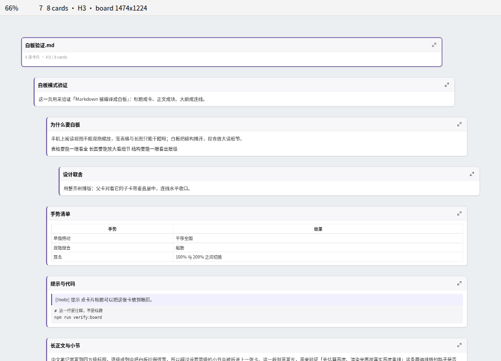
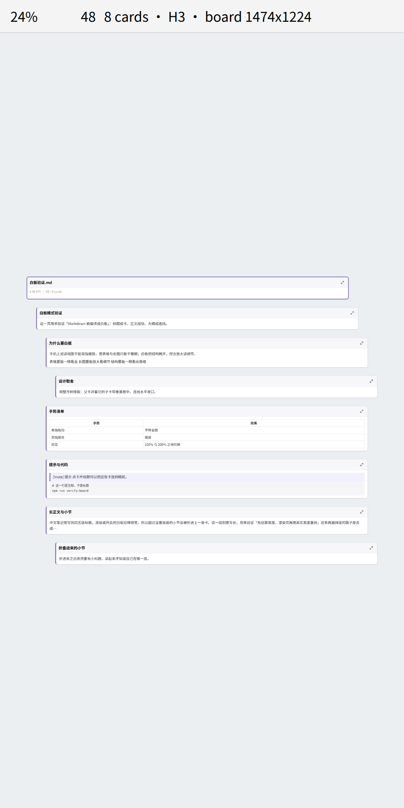

# Zoomable Reader

> 两种读法：**版面**（整页放在可缩放的板子上）与**白板**（把 Markdown 编译成卡片画布）。
> 手机上双指捏合，桌面按 Ctrl 滚轮，拖动即平移。

Read any note on a pan-and-zoom board — or compile it into a **whiteboard**: every heading becomes
a card, each card holds that section, and connectors draw the outline. Pinch on mobile, Ctrl and
wheel on desktop, drag to pan.

[](LICENSE)


## 中文速览

- **白板模式**：把一篇 Markdown 编译成 **一栏 1280px（网页版心宽）** 的长页，**往下滑就是往下读**
  （默认「单栏纵向流」；标题成节、缩进表达层级、打开即原大；工具栏有「适配栏宽」一键把整栏铺满屏）。
  想要「横着看全局」就在设置里换成 **分支树**：标题成列成卡、连线成大纲。想要纸的感觉可以把栏宽调到
  560（A5）或 794（A4）。**每次进白板都重新编译一遍**，笔记改了白板跟着变（只读，不落盘）。
  设置 → **白板模式 → 打开笔记时的默认模式 → 白板**，之后就默认进白板。
- **双指捏合在哪**：设置页第一组就是 **手势与缩放 → 双指捏合缩放**（还有一张「手势速查」表）。
  手机上要能缩放，必须用**本插件的视图**打开笔记（侧边栏放大镜图标、命令面板，或文件列表长按
  → 「编译成白板」）—— Obsidian 自带的阅读视图无法缩放，这是应用层限制，任何主题都改不了。
- **设置页中英对照**：每一项都是「中文 / English」，并且能进 Obsidian 1.13+ 的**设置搜索**
  （打「双指」或 pinch 都能直接跳到那一项）。
- **放大按钮默认在左上角**：右上角是 Obsidian 自己的「编辑源文件 / 更多选项」入口，按钮贴在那儿
  会把它盖住。想放回右上角：设置 → 图片与图表查看器 → 放大按钮的位置。

## Why this exists

Obsidian's reading view cannot be pinch-zoomed on mobile, and no theme can change that: the app
runs in a WebView whose zoom is a native, app-level switch (Capacitor's `zoomEnabled`, off by
default), plus a `user-scalable=no` viewport declaration. CSS cannot reach either one.

A plugin can. Zoomable Reader opens the note in its own view, renders it into a transformable
layer, and handles the gestures itself — so pinch-to-zoom finally works on a phone, and wide
diagrams or screenshots can be read by zooming in instead of squinting.

## Usage

1. Open a note, then run **Zoomable Reader: 打开当前笔记 / open the active note** from the command
   palette, or click the **zoom-in icon** in the ribbon. On mobile you can also long-press a file in
   the file list and choose **编译成白板 / open as a whiteboard**.
2. Gestures:

| 手势 / Gesture | 手机 / Mobile | 桌面 / Desktop |
|---|---|---|
| 平移 Pan | 单指拖动 one-finger drag | 拖动 drag, wheel, trackpad |
| **缩放 Zoom** | **双指捏合 two-finger pinch** | **Ctrl / ⌘ + wheel** |
| 放大到 200% | 双击 double tap | 双击 double click |
| 放大 / 缩小 / 复位 | 工具条按钮 toolbar | 工具条, `+` `-` `0` |
| 聚焦一张卡 | 点卡片标题 tap the card title | 点卡片标题 click the card title |

3. The toolbar has zoom out, the current zoom level (click it to reset), zoom in, fit, and a mode
   switch (page ⇄ whiteboard). In whiteboard mode it also has **回到全图 / fit the whole board**
   and **回到标题卡 / back to the title card**.

Notes:

- The note's column width follows your theme (`--file-line-width`), and on a phone it never
  exceeds the viewport — so 100% is already "one screen wide", and zooming only ever magnifies.
- Zoom and position are remembered per note **and per mode**: page and whiteboard keep their own
  zoom, because they are different sizes. Everything is stored in this plugin's own `data.json`
  inside your vault.
- The view is a board, so dragging pans instead of selecting text. Use the normal reading view
  when you need to select or edit text.

## Whiteboard mode: the note compiled into cards



Two layouts, one compiler. The default is **single column**: one 1280 px column (a desktop web
content width — wide enough for long lines, so scrolling down *is* reading down), sections stacked in
document order with indentation for hierarchy, and a **fit column width** button that fills the
viewport with the column so only vertical movement remains. Switch to **branch tree** when you want
the whole outline sideways; set the column to 560 px (A5) or 794 px (A4) if you prefer a sheet of
paper. This is not "the note floating on a board" — the Markdown itself is compiled:

- **Every heading becomes a card**, holding that section's content. Frontmatter is skipped (it is
  metadata, not the note). Code fences, tables, callouts, quotes, math, images and Mermaid blocks
  each become a block inside their card, with the type detected — a `#` inside a code fence is
  *not* a heading.
- **An outline laid out as a tidy tree**: children sit in the next column, vertically centred
  against their parent, with a bezier connector from the parent's right edge to the child's left
  edge. Heading level jumps (`#` straight to `###`) attach to the nearest shallower heading
  instead of losing their depth.
- **Two-pass layout**: heights are estimated first (so the board appears immediately), then measured
  from the real DOM and laid out again — Chinese line wrapping, images and tables have sizes only
  the browser knows.
- **Deep headings fold into their ancestor card** as sections. Chinese notes often go four or five
  levels deep, and one column per level turns the board into a thin ribbon. Set the depth in the
  settings; a **card limit** folds deeper automatically, so a note with hundreds of headings cannot
  stall a phone.
- **Parents sit at the top of their children, not in the middle.** A classic tidy tree centres a
  parent against its children band, which on a document board pushes a short title card into the
  middle of the screen and leaves the top half empty — reported as "the whiteboard looks tiny".
  Top-aligned, the top-left corner is content and you read downward, like paper.
- **Tap a card title to bring it to the front** (240 ms transition), **回到全图** to see the whole
  outline, and dragging empty space pans the board as usual. Links inside a card keep their normal
  meaning — only the card head and its focus button zoom.



Whiteboard settings: **打开笔记时的默认模式 / default mode**, **卡片宽度（纸张大小） / card
width (paper size)** (320–900 px, default 560 px ≈ A5), **卡片展开层级 / outline depth** (H1–H6),
**卡片间距 / card spacing**, **显示连线 / connectors**, **卡片数量上限 / card limit**.

Width first: the default column is **1280 px**, the content width a desktop web page uses — long
lines, and the whole column fits a normal screen so reading is a vertical gesture. The slider also
names the paper presets (A5 = 148 mm ≈ 560 px, A4 ≈ 794 px) for anyone who wants a book measure. The
board opens at **natural size** (not shrunk to fit), and 适配栏宽 / *fit column width* takes you to
"see the whole column, scroll down" in one tap.

The board is a *view*: it is recompiled every time you enter whiteboard mode, and it recompiles
again whenever the note changes (a save, or live typing in another pane, throttled to 400 ms).
Nothing is written back. There is a **重新编译 / recompile** button in the toolbar if you want to
force a refresh.

## Privacy and disclosures

- **No network access.** This plugin makes no HTTP requests and loads no remote assets.
- **No telemetry.** Nothing is collected, and nothing leaves your device.
- **No access outside your vault.** The plugin only reads notes through Obsidian's own vault API.
- The only data it writes is `data.json` in this plugin's folder (your zoom levels and positions).
- No ads, no accounts, no payment.

## Settings

Every setting is labelled in Chinese **and** English, grouped by what it does, and indexed for
Obsidian 1.13+ **settings search** — typing 双指 or pinch jumps straight to the two-finger switch.

| 设置 / Setting | 默认 / Default | 作用 / What it does |
|---|---|---|
| 双指捏合缩放 / Two-finger pinch zoom | on | The mobile zoom gesture. Off: two fingers only pan with their midpoint |
| 捏合灵敏度 / Pinch sensitivity | 1x | 1x doubles the zoom when the finger distance doubles |
| 双击放大倍数 / Double-tap zoom | 2x | How far a double-click or double-tap zooms in |
| 最大放大倍数 / Maximum zoom | 64x | Upper limit for pinch and wheel zoom |
| 打开笔记时的默认模式 / Default mode | 版面 page | 版面 page or 白板 whiteboard |
| 显示工具条 / Show toolbar | on | Zoom buttons, zoom level, mode switch, fit |
| 版心四周留白 / Page padding | 16 px | Gap between the note and the edge (page mode) |
| 白板排版 / Board layout | 单栏纵向流 single column | 单栏纵向流 scroll down to read, or 分支树 branch tree to see the outline sideways |
| 栏宽（卡片宽度）/ Column width | 1280 px（网页宽 Web） | 1280 = desktop web content width; 560 = A5, 794 = A4 for a paper feel |
| 卡片展开层级 / Outline depth | H3 | Headings deeper than this fold into the ancestor card |
| 卡片间距 / Card spacing | 32 px | Vertical gap; parent-to-child spacing is 2.5x that |
| 显示连线 / Show connectors | on | Parent-to-child bezier connectors (branch-tree layout; the single column shows hierarchy by indentation) |
| 卡片数量上限 / Card limit | 120 | Above this the board folds deeper automatically |
| 放大按钮的位置 / Zoom button corner | 左上 | 左上 or 右上 — the top-right belongs to Obsidian's own controls |
| 放大按钮常驻显示 / Always show the zoom button | on | Off: the button only appears on hover |
| 点击图片打开可缩放查看器 / Click images to open a viewer | on | Full-screen image viewer |
| 点击图表打开可缩放查看器 / Click diagrams to open a viewer | on | Same viewer for Mermaid, Excalidraw, charts |
| 点图片本身也打开查看器 / Open the viewer by clicking images too | off | On: a plain click on an image opens the viewer |
| 查看器打开时适配窗口 / Fit to window when the viewer opens | on | Off: images open at 100% |
| 图表框随文字走 / Wider diagram boxes | on | Raise Mermaid's 200 px label cap so Chinese labels stop folding |
| 标签最大宽度 / Max label width | 460 px | How wide a label may get before it wraps |
| 记住每篇笔记的缩放与位置 / Remember zoom and position | on | Per note and per mode, stored locally |
| 清除已保存的缩放与位置 / Clear saved zoom and positions | — | Forgets every note's saved zoom |

## Image viewer

Every image and diagram carries a small button — by default in its **top-left** corner, because the
top-right corner is where Obsidian puts its own **编辑源文件 / edit source** and more-options
controls, and the button used to cover them. Move it back in the settings if you prefer.

- Zoom: mouse wheel with **Ctrl** or **Cmd**, the toolbar buttons, `+` `-` `0`, or a two-finger
  pinch on mobile.
- Pan: drag. Double-click (or double-tap) toggles between 100% and fit.
- Close: `Esc`, the `x` button, or a click on the empty background.
- The toolbar shows the real size and the size currently on screen, so you can tell when you are
  at 100% of a 4K screenshot.
- Nothing is decorated: images are shown as they are, and diagrams keep their transparent
  background with solid lines and text — the same look as in the note, only bigger.
- A diagram in the viewer looks like the diagram in the note, not merely similar: the moved
  node keeps its `.mermaid` ancestry, so the theme's text styles still apply, and its size is
  pinned to the size it had in the note — no silent rescale, so labels do not reflow.


## Diagram layout: boxes follow the text

Mermaid caps a label at `flowchart.wrappingWidth = 200`, so a long Chinese label folds into four
or five narrow lines. PlantUML does the opposite — a box grows to fit its text and only wraps where
the author breaks a line — and that is the look this plugin brings to Mermaid:


- **Max label width** (default 460 px) replaces Mermaid's 200 px cap. A 46-character label goes from
  four lines in a 215 px box to two lines in a 478 px box.
- **More padding and spacing** — the box interior (15 px → 18 px), node and rank spacing, and roomier
  sequence diagrams (participant margin 50 px → 60 px).
- It is a *rendering* parameter, not styling: CSS cannot reach the layout engine, which is why this
  lives in the plugin rather than in the theme.
- Your host's own settings are left alone. `mermaid.initialize()` replaces nested config objects
  instead of merging them, so passing a partial config would drop Obsidian's
  `themeVariables.fontFamily: var(--font-mermaid)` and send Chinese text back to Mermaid's default
  `trebuchet ms`. The plugin reads the live config first, merges on top of it, and hands the whole
  thing back.
- Mermaid loads lazily, so the plugin retries until it appears and re-checks on `layout-change`.
  Diagrams already open pick the new layout up the next time they render.
- Turn it off in the settings if you prefer Mermaid's own sizing.

## Installation

**From the community directory** (after this plugin is published): Settings → Community plugins →
Browse → search for "Zoomable Reader".

**Manually**
1. Download ```main.js```, ```manifest.json``` and ```styles.css``` from the
   [latest release](../../releases/latest).
2. Put them in ```<your vault>/.obsidian/plugins/zoomable-reader/```.
3. Enable **Zoomable Reader** in Settings → Community plugins.

## Development

```bash
npm install
npm run dev             # esbuild watch → main.js
npm run typecheck       # tsc --noEmit
npm test                # vitest: zoom math, board compiler, layout, settings contract
npm run verify:gestures # real Chromium: wheel, Ctrl+wheel, drag, pinch, double-tap, button corner
npm run verify:board    # real Chromium: whiteboard geometry, two-pass layout, focus, pinch
npm run build           # production bundle
npm run check           # everything above, in order
```

Nothing about the gestures is taken on faith: `verify:gestures` drives a real Chromium with
`mouse.wheel`, pointer drags and CDP-synthesised touch events, and asserts the anchor invariant —
the content under your finger must not move while zooming. `verify:board` renders a real board in
the same browser and asserts the geometry from the **DOM**: no two cards overlap, every card sits
inside the board bounds, every connector lands on its cards' edges, the measured card height equals
the layout height (that is the second pass doing its job), and a click on a card title really
centres that card — on desktop and with real touch events on a phone viewport.

Repository layout:

```
main.ts               plugin entry: view registration, commands, file menu, settings storage
src/view.ts           the ItemView: page mode and whiteboard mode
src/zoom-pan.ts       zoom math (pure functions) + ZoomPanLayer (pointer gestures)
src/board-model.ts    Markdown → card model (pure: headings, blocks, folding)
src/board-layout.ts   tidy-tree layout for the board (pure: geometry + connectors)
src/board-render.ts   board DOM rendering (no obsidian import, so a browser can verify it)
src/settings-spec.ts  settings as data: bilingual labels, controls, search aliases
src/settings.ts       the settings tab: declarative (1.13+) and imperative fallbacks
src/lightbox.ts       the image and diagram viewer
styles.css            view styles, using Obsidian CSS variables only
tests/                vitest suites + the browser harnesses
tools/                the Playwright verifiers
```

## Compatibility

- Obsidian **1.5.7** or newer (uses `MarkdownRenderer.render` and `View.scope` for the keyboard
  shortcuts). On 1.13+ the settings page is declared through `getSettingDefinitions`, so every
  setting shows up in the settings search; older versions get the same content rendered
  imperatively from the same data.
- Desktop and mobile. No Node.js or Electron APIs are used, hence `isDesktopOnly: false`.
- Works with any theme: the note and the board cards are rendered with your theme's styles, and the
  board itself uses Obsidian's public CSS variables.

## License

MIT — see [LICENSE](LICENSE).

If this plugin saves you some squinting, you can [support its development](SPONSOR.md).
